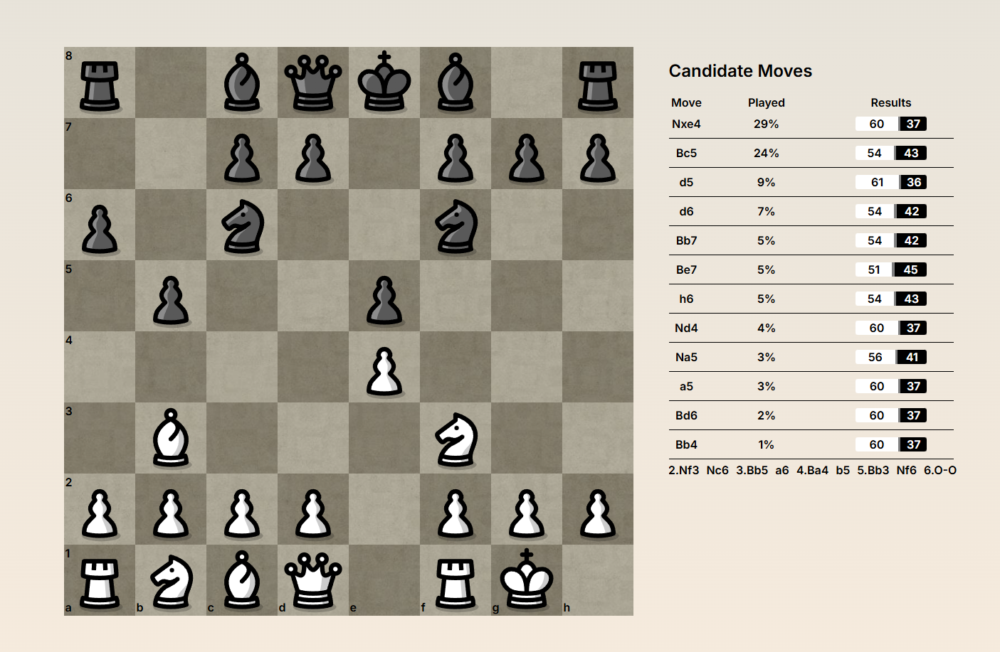

# Chess Trainer

A chess opening trainer inspired by [Chessbook](https://www.chessbook.com), built with React and TypeScript. It currently shows which moves real players make from any position around a certain rating (set to 1000-1199 at the moment), using game data from the Lichess Opening Explorer.


**Live demo:** https://chess-trainer-gcipriani.vercel.app



## Features

- A chess engine written from scratch, fully playable with automatic queen promotion.
- A candidate moves panel that updates after every move, showing frequency and win rate of lines.

## Tech stack

React 19 · TypeScript (strict) · Vite · Vitest · GitHub Actions · Vercel (hosting and serverless functions) · Lichess Opening Explorer API

## How it works

- **Engine.** Move generation, check detection and special moves are plain TypeScript functions, kept separate from the UI.
- **State.** The game state lives in a single reducer, so the board, turn and move history always change together. Check and checkmate status is calculated from that state on each render rather than stored separately.
- **Serverless proxy.** The Lichess Opening Explorer requires an API token, so the browser calls a small serverless function (`/api/explorer`), which adds the token on the server and forwards the request to Lichess.

## Running locally

You'll need Node.js, the [Vercel CLI](https://vercel.com/docs/cli) (`npm install -g vercel`), and a [Lichess API token](https://lichess.org/account/oauth/token) with no scopes selected.

```bash
cd chess-frontend
npm install
vercel link                              # create or link a Vercel project
vercel env add LICHESS_TOKEN development # paste your token when prompted
vercel dev                               # runs the app and the API at http://localhost:3000
```

## Tests

```bash
cd chess-frontend
npm test
```

Tests cover FEN generation, board updates and check detection. CI runs the tests, a type check and a production build on every push to `main`.

## Roadmap

- [ ] Play a move by clicking it in the candidate moves panel
- [x] Piece movement animation
- [ ] Move history in standard notation
- [x] Undo/Redo functionality
- [ ] Repertoire building: save lines and track coverage
- [ ] Engine evaluations
- [ ] Backend and database for saved repertoires
- [ ] Spaced-repetition training